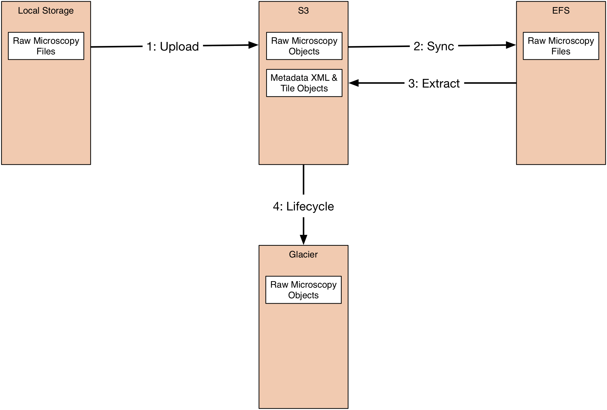

# Technologies

Minerva is designed to make use of numerous technologies, many of which are
provided by Amazon Web Services.

## Cloudformation/Serverless Application Framework

Cloudformation and Serverless are used to deploy the platform in an automated
fashion.

## S3

S3 is used as the primary data storage medium. Raw data is imported directly
into S3 and the extracted tiles and metadata are also stored within S3 buckets.

## Glacier

Glacier is optionally used to store raw microscopy data at a lower storage level
for cost efficiency.

## Cognito

Cognito User Pools are used to register and manage the pool of users, and to
faciliate user login.

## RDS (Postgres)

A standard postgres relational database is deployed using RDS. This is used to
store the operational information such as which images were imported in a
certain import, which users are in a certain group, etc. It is also the record
of grants, such as a certain user having read-only access to a certain
repository.

## API Gateway

API Gateway is used to build the REST interfaces that are used to import,
manage, visualise and retrieve data. It also handles basic user authentication
via Cognito to ensure only registered users can access the system.

## Lambda

Lambda is used to provide serverless computing for tasks that have a short
runtime especially if they might have a high elasticity of demand. This includes
providing the backend of the REST API (e.g. Creating a new repository through
the API), managing individual operations of the batch processing (e.g.
Inserting a job into the queue), and various internal actions (e.g. Adding a
user registered with the Cognito user pool to the application database).

## Docker

Docker is used to containerise longer running batch operations (e.g. extracting
tiles and metadata XML from raw microscopy data with Bio-Formats for use in
Batch.

## Batch

Batch is used to manage the Dockerised operations. It has the authority to
operate a cluster (using both spot instances and on-demand EC2) within given
limits. The cluster will be scaled automatically in proportion to the number of
batch jobs waiting to be processed. It will also scale down to a given minimal
cluster size (potentially zero nodes) when demand is low or nonexistent. Batch
also manages the queue of jobs waiting to be processed.

## EFS

The Elastic File System is used to provide a standard POSIX filesystem over NFS
which is required for Bio-Formats (and potentially other filesystem based tools)
to process the data from its original format into the tiles and extracted
metadata document. A single EFS share is made available to all Batch instances.

# Data Flow

Raw microscopy data when imported into Minerva is processed to extract the
microscopy metadata (as OME-XML) and to generate a pyramid of tiles that become
the operational unit of data used. The original data is also (optionally)
retained.

Raw microscopy data is imported directly into an S3 bucket prefix created for
this specific import operation. Any quantity of files can be imported and of any
type. This can be accomplished using any tools or libraries which support S3.

Once the import is completely uploaded to S3, then an operation to process this
data into the OME-XML and tiles is initiated. In order for the data to be
evaluated by Bio-Formats it is necessary for it to be transferred to a
filesystem. The AWS Elastic File System is used for this purpose, it is a
scalable NFS based storage platform which can be accessed from the batch
infrastructure doing the Bio-Formats scan and subsequent extraction.

After synchronising the imported data from S3 to EFS, a scan operation is run
over all this data in which Bio-Formats attempts to discover candidate filesets
for import. For each candidate discovered, the fileset will be registered with
the database along with certain basic metadata about it including the
Bio-Formats reader which was recognised as being appropriate for this fileset.
For each candidate found an extraction operation is begun.

The extraction using Bio-Formats is a separate operation for each candidate so
that it can be scaled horizontally. Each operation works only on its assigned
candidate fileset and will extract the OME-XML metadata (suitably modified to
reflect the UUIDs that the images have been assigned within this system). It
will also generate a pyramid of PNG tiles which are written directly to S3 with
keys that can subsequently be used to retrieve them logically.

The final step is that depending on the settings of the repository into which
the data is imported, the raw data that has been extracted by Bio-Formats is
lifecycled. Currently this means either leaving the data in S3 (i.e. doing
nothing), deleting it (obviously not to be used if original data should be
preserved) or archiving it to Glacier. Data which has not been recognised by
Bio-Formats (e.g. associated CSV files) will remain in S3.

## Data Organization & Authorization

### Repository
Repositories are the top-level concept in managing data in Minerva. Many imports
can be made into a single repository. Repositories can be created by any
authorised user (who will automatically be an administrator of the new
repository) and then go on to authorise other users or groups to have specific
permissions on the repository. Repositories are recorded in the database and
have no object storage structure of their own.

### Import
Imports are collections of data imported in a single operation. Each import has
an S3 prefix assigned to it, inside of which all the files to be imported will
be placed as objects. Imports, their repository membership, and their status
(such as whether it has been processed or not yet) are recorded in the database.

### Fileset
Filesets are collections of objects that correspond to a single Image or Plate.
The actual objects are already stored (or possibly have been deleted depending
on the lifecycling rules) in S3/Glacier, but the membership is recorded in the
database.

### Image
Images represent a single image potentially with multiple channels, time-points
and Z-stacks. These are recorded in the database along with the repository and
import membership. All the tiles that are associated with an image are stored
within an S3 prefix with a specific key naming convention so that they can be
indexed into easily.

### User
A User is a single user recorded in the database and also in Cognito.

### Group
A Group is a collection of Users and is recorded in the database.
