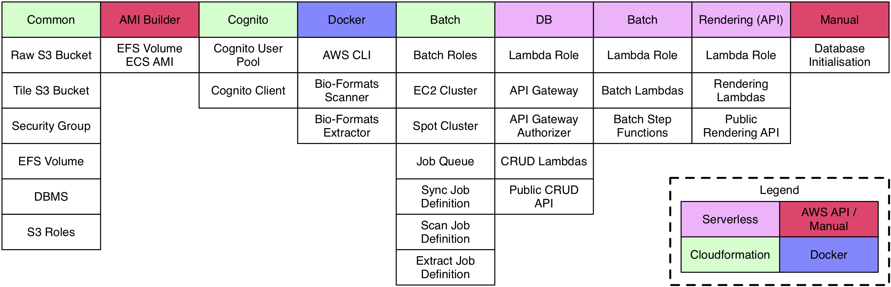

# Deployment

The deployment is broken up into several stages to reflect the various specific
requirements of the infrastructure they are each provisioning. Each stage
leverages either AWS Cloudformation, Serverless, Docker or the AWS API.

Stages must be initially deployed in a specific order, but can subsequently be
updated independently as long as there are no update-inter-dependencies between
the stages. Other than where it is appropriate to have hard decencies between
stages, steps have been taken to decouple the stages where possible.

All stages are driven from a common configuration file.

### Cloudformation

Cloudformation templates are used to provision infrastructure that does not
have a code component, such as the DBMS, Cognito user pools etc.

### Serverless

Serverless configurations are used to provision serverless infrastructure such
as lambda functions, step functions and also the API Gateway.

### Docker

Docker is used to deploy the containerised code for use during AWS Batch jobs.
In the general case these will be publicly available on DockerHub.

### AWS API

The AWS API is used to deploy one specific piece of that infrastructure which
is impossible with Cloudformation. This is the AMI-Builder script used to build
an AMI bound to the EFS volume used in a deployment.

## Stages

### Cloudformation - Common

This stage provisions the most fundamental pieces of the deployment which are
updated extremely infrequently. This includes all of the data storage,
comprising of two S3 buckets, an EFS volume and a Postgres Database Management
System. It also includes various generic configurations such as a security
group.

### AWS API - AMI-Builder

This stage looks-up the EFS volume provisioned in
[Cloudformation - Common](#cloudformation-common) and builds an ECS
compatible (because AWS Batch is powered by the Elastic Compute Service) Amazon
Machine Image that has the EFS volume mounted when instantiated. This is a
necessary evil until such time as AWS Batch Compute Environment configurations
supports an instance initialisation hook.

### Cloudformation - Cognito

This stage provisions the Cognito user pool and application configuration
necessary to register, manage and authenticate users. This is separated from
[Cloudformation - Common](#cloudformation-common) only because it is highly
likely to be pluggable and/or very customisable between deployments.

### Docker

Three Docker images are required by the AWS Batch job definitions. These will
generally be publicly available from DockerHub and thus do not require
deployment as such. These are highly likely to be pluggable and have a
significant onus on version management.

### Cloudformation - Batch

This stage provisions the resources required to use AWS Batch. This includes
compute environments in both EC2 and Spot, a job queueing unifying the
environments and definitions of the batch jobs that will be run on them. Each
batch job makes use of one of the three Docker images.

### Serverless - DB

This stage builds (using local Docker) and deploys lambda functions that serve
requests to the public REST API, and builds and deploys lambda functions that
are used internally. It also deploys the API Gateway which provides the public
REST API.

### Serverless - Batch

This stage builds and deploys lambda functions that are used to orchestrate the
batch processing of data. Those lambda functions are themselves managed by
step functions which are deployed in this stage also.

### Serverless - Rendering

This stage builds and deploys lambda functions related to image rendering. This
is separated out from [Serverless - DB](#serverless-db) because it has very
different dependencies. This also augments the public REST API with the
rendering functionality.

### Manual - Database Initialisation

There is currently no automated system for managing the database initialisation
or doing updates. A lambda function for internal use is deployed and can be
used for this purpose.
